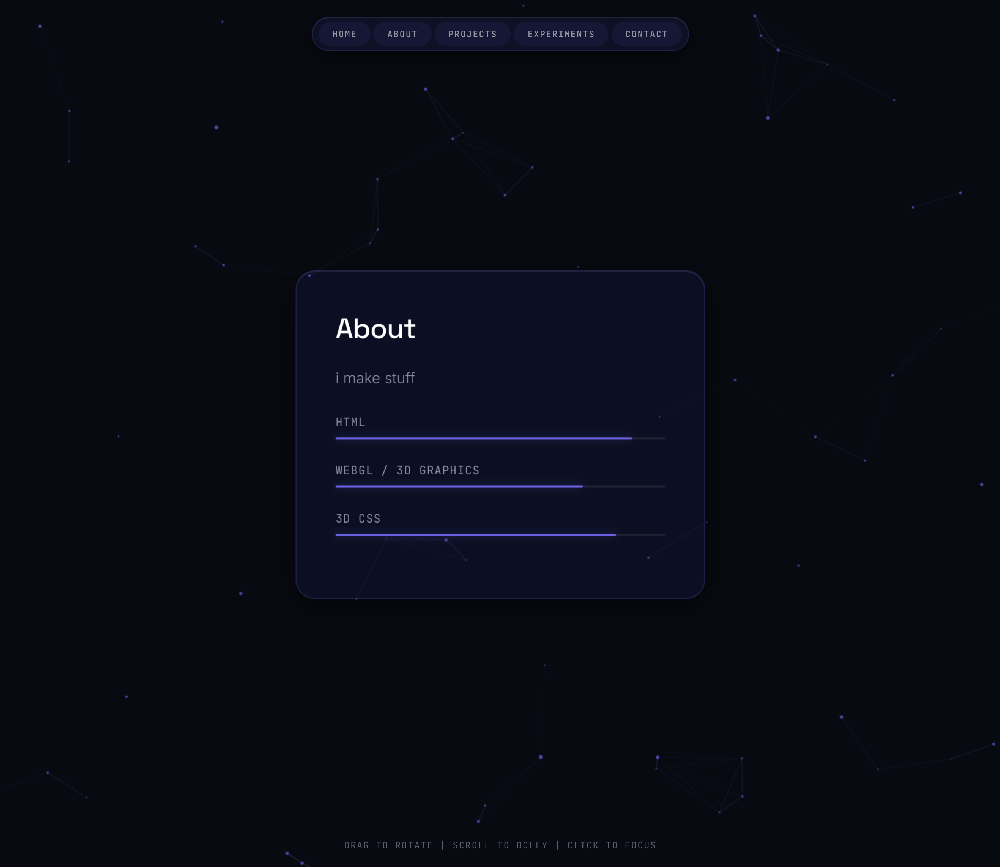

# 3d portfolio template

### description
a single-file, immersive 3d portfolio experience. config-driven, minimalistic, glassmorphism aesthetic with a focus on spatial interaction.

### features
- **config-driven**: edit your bio, projects, and skills from a single json-like config block—no html/css hunting required.
- **6-dof spatial camera**: smooth tracking and zoom logic.
- **proximity rendering**: nodes dynamically render and intercept clicks based on camera distance to save memory.
- **performant**: built specifically for performance. avoids heavy filters on massive elements to prevent compositing crashes on mac/webkit.
- **dynamic styling**: configurable themes to fit your style.

### requirements
- modern browser with hardware acceleration.
- mouse/trackpad (recommended for 3d navigation).

### setup
1. clone or download the repository.
2. open `index.html` in your editor.
3. edit the `CONFIG` object at the very top of the `<script>` tag (lines 643-699)
4. open `index.html` in a modern browser. no build step required.

**what's in `CONFIG`:**

| key | what it does |
|---|---|
| `name`, `title` | your name and page title |
| `theme` | color/glass preset (`forge`, `midnight`, `arctic`, `terminal`, `ember`) |
| `bg` | background effect (`none`, `particles`, `scanlines`, `nebula`) |
| `camera` | scroll speed, drag speed, easing, and focus distance |
| `bootSequence` | lines shown on the loading screen |
| `nav` | nav bar button labels |
| `about` | bio text and skill bars |
| `projects` | project cards (name, desc, pose) |
| `experiments` | experiments section text |
| `contact` | contact form labels, button text, and social links |

### file structure
everything lives in `index.html`. the file is split into three sections:

- **`<style>`**: theme tokens (`:root` css variables), component styles, animations
- **`<body>`**: minimal html shell. contains `#viewport` → `#scene` (the 3d world), fixed ui overlays (nav, load screen), and background effect layers
- **`<script>`**: split into two parts:
  + **`THEMES` / `CONFIG`** (top, editable): all user-facing content and settings. change this to customize your portfolio
  + **render + engine** (bottom, do not edit): parses `CONFIG`, renders html from it, drives the camera, background effects, and proximity detection loop

### constraints
- **single-file**: no external assets. google fonts are used, but can be removed, and images are for docs only.
- **vanilla-only**: zero dependencies. pure html, css transforms, and js.

### what its for
curating engineering projects, prototypes, and artifacts in a persistent spatial environment.
